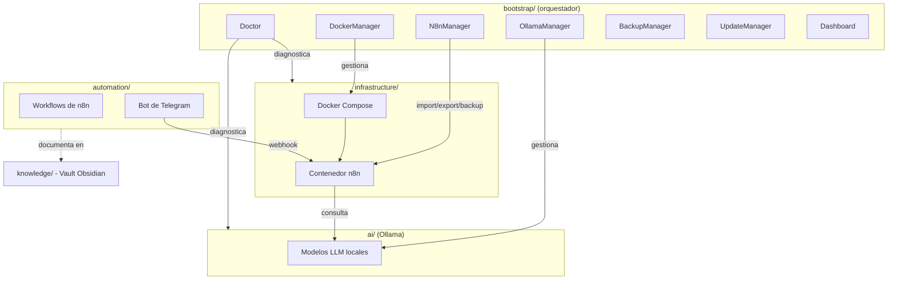

# Manual - Cap 1 - Arquitectura y Filosofia

---

## Introduccion

IA-LOCAL no es una coleccion de herramientas instaladas al azar. Es un ecosistema modular donde cada pieza tiene una responsabilidad clara y ninguna depende de los detalles internos de otra. Este capitulo explica el porque de esa estructura antes de tocar ninguna herramienta concreta.

## Diagrama: las piezas y como se relacionan

## Los cuatro principios (y por que importan en la practica)

**No instalar servicios directamente en Windows.** Docker aisla cada servicio (n8n) en su propio contenedor. Si algo se rompe, se destruye y recrea el contenedor sin afectar al sistema operativo — es lo que hace segura la opcion "Actualizar imagen de n8n" del Update Manager.

**Todo debe poder automatizarse.** Cada tarea repetitiva (diagnostico, backup, actualizacion) es un modulo del bootstrap, no una serie de comandos que hay que recordar.

**Todo debe estar documentado.** Este mismo manual, `docs/PROGRESS.md` y este vault son la memoria del proyecto — sin ellos, cualquier pausa larga significa tener que re-descubrir decisiones ya tomadas.

**Todo debe ser modular.** Ningun modulo importa archivos internos de otro directamente; solo se comunican via funciones exportadas (`Common.psm1` es el ejemplo mas claro: `Write-Log` y `Get-ProjectRoot` se usan desde Doctor, DockerManager, N8nManager, OllamaManager, BackupManager, UpdateManager y Dashboard sin que ninguno duplique esa logica).

## Ejemplo practico: anadir un servicio nuevo sin romper nada

1. Se anade como un nuevo servicio en `infrastructure/docker-compose.yml`.
2. Si necesita gestion propia (backups, diagnostico), se crea un modulo nuevo en `bootstrap/modules/`, importando `Common` igual que los demas.
3. Se anade una opcion nueva al menu de `install.ps1`.
4. Ningun modulo existente necesita cambiar una sola linea.

Eso es la modularidad funcionando: crecer sin rediseñar.

## Buenas practicas

- Una responsabilidad por carpeta y por modulo.
- Nombres de scripts en `PascalCase-Verb-Noun.ps1` siguiendo los verbos aprobados de PowerShell.
- Configuracion siempre en archivos dedicados (`.env`, `.json`), nunca "hardcodeada" en el codigo.
- Comentarios de codigo en ingles; documentacion de usuario final en espanol.

## Errores frecuentes (reales, de este mismo proyecto)

> **Los `.ps1` deben ser ASCII puro.** PowerShell 5.1 en Windows lee los scripts con la codificacion ANSI del sistema si no llevan BOM UTF-8. Un solo caracter especial (tilde, ñ, guion largo) puede corromper el parseo varias lineas mas adelante en el archivo, con un mensaje de error que no apunta a la causa real.

> **Los scripts descargados quedan bloqueados por Windows.** Cualquier `.ps1` descargado desde el navegador se marca como "de Internet" y PowerShell se niega a ejecutarlo (`UnauthorizedAccess`) aunque la politica de ejecucion sea correcta. Solucion: `Unblock-File` antes de la primera ejecucion.

## Ejercicio

Sin mirar el codigo, dibuja de memoria el diagrama de este capitulo con tus propias palabras. Si te cuesta explicar por que `Common.psm1` existe, vuelve a leer la seccion de los cuatro principios antes de seguir al capitulo 2.

## Resumen

La arquitectura de IA-LOCAL se apoya en cuatro principios (no instalar en Windows directamente, automatizar, documentar, modularizar) que se traducen en decisiones concretas: Docker para aislar servicios, un modulo `Common` compartido para evitar duplicacion, y una estructura de carpetas donde cada una tiene un unico proposito.

## Checklist del capitulo

- [ ] Entiendo por que Docker aisla los servicios en vez de instalarlos en Windows
- [ ] Se para que sirve el modulo `Common` y por que evita duplicacion
- [ ] Se por que los scripts `.ps1` deben ser ASCII puro
- [ ] Se que hacer si un `.ps1` descargado no se ejecuta (`Unblock-File`)

## Glosario del capitulo

- **Modulo (PowerShell)**: conjunto de funciones relacionadas, empaquetado en un `.psm1` con su manifiesto `.psd1`, que se puede importar en otros scripts.
- **Contenedor**: entorno aislado donde corre un servicio (ej. n8n), sin instalarse directamente en el sistema operativo del host.
- **ASCII puro**: texto que usa solo los caracteres basicos ingleses (sin tildes, eñes ni simbolos especiales), evitando problemas de codificacion en PowerShell 5.1.

## Ver tambien

- [[Manual Tecnico - Indice]]
- [[Manual - Cap 2 - Preparacion del entorno]]
- [[Arquitectura del proyecto]]
