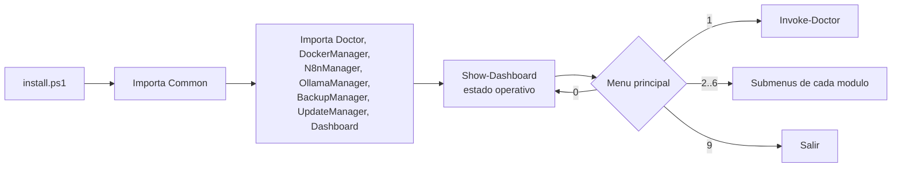

# Manual - Cap 2 - Preparacion del entorno

---

## Introduccion

Antes de levantar ningun servicio, el proyecto necesita saber en que estado esta el equipo: ¿esta Docker instalado?, ¿esta corriendo?, ¿tenemos Git, VS Code, Ollama, n8n accesible? Esa es la responsabilidad del modulo **Doctor**, y el **menu principal** (`install.ps1`) es la puerta de entrada a el y a todos los demas modulos.

## Diagrama: flujo de arranque

## Ejemplo practico: interpretar el informe de Doctor

Al ejecutar la opcion 1, Doctor comprueba, entre otros: Docker CLI, si el daemon de Docker esta activo, Git, VS Code, Ollama, Obsidian (buscando el ejecutable en rutas conocidas) y si n8n responde en `http://localhost:5678`. El resultado se muestra en una tabla y tambien se guarda en `bootstrap/logs/Doctor-<fecha>.log`.

Si un componente aparece como no instalado pero tu sabes que si lo esta, lo mas probable es que el PATH de la sesion actual de PowerShell este desactualizado (ver "Errores frecuentes").

## Buenas practicas

- Ejecutar Doctor (opcion 1) despues de cualquier instalacion nueva, antes de asumir que algo funciona.
- Revisar el Dashboard (opcion 0) al empezar cada sesion de trabajo, no solo al arrancar `install.ps1`.
- No editar los modulos del bootstrap directamente sin pasar por `Common` para logging y rutas - evita duplicar logica que ya existe.

## Errores frecuentes (reales, de este mismo proyecto)

> **"No se cargó el módulo... no se encontró ningún archivo de módulo válido en ningún directorio de módulo."** Este error aparecio al faltar el archivo `.psm1` de un modulo nuevo (el manifiesto `.psd1` estaba, pero no su script asociado). Causa tipica: al descargar varios archivos de golpe, a veces solo se guarda uno. Solucion: comprobar con `Get-ChildItem` que ambos archivos (`.psd1` y `.psm1`) estan en la misma carpeta del modulo.

> **Ollama "no encontrado" justo despues de instalarlo.** Windows anade el ejecutable al PATH durante la instalacion, pero una terminal ya abierta no recarga esa variable sola. Solucion: cerrar **todas** las ventanas de PowerShell abiertas y abrir una nueva antes de volver a probar.

## Ejercicio

Ejecuta `install.ps1`, entra en Doctor, y sin mirar el codigo, explica que diferencia hay entre lo que comprueba Doctor y lo que muestra el Dashboard (opcion 0). Si la respuesta no te sale con seguridad, revisa la nota [[Modelos instalados]] y compara con la descripcion del Dashboard en este capitulo.

## Resumen

`install.ps1` es el unico punto de entrada del proyecto. Importa `Common` y todos los modulos, muestra el Dashboard automaticamente al arrancar, y desde ahi se accede al menu principal que conecta con Doctor y el resto de gestores.

## Checklist del capitulo

- [ ] Se ejecutar `install.ps1` y entender que hace el Dashboard automatico al arrancar
- [ ] Se para que sirve Doctor y que comprueba exactamente
- [ ] Se que hacer si un modulo da error de "no se encontro archivo de modulo valido"
- [ ] Se que reiniciar la terminal soluciona la mayoria de problemas de PATH tras instalar algo nuevo

## Glosario del capitulo

- **PATH**: lista de carpetas donde el sistema operativo busca ejecutables cuando escribes un comando. Si un programa no esta en el PATH, hay que escribir su ruta completa o el comando no se reconoce.
- **Manifiesto de modulo (`.psd1`)**: archivo que describe un modulo de PowerShell (version, funciones exportadas, archivo `.psm1` asociado), sin contener la logica en si.
- **Dashboard**: vista de estado operativo (servicios corriendo ahora mismo), distinta del diagnostico de instalacion que hace Doctor.

## Ver tambien

- [[Manual Tecnico - Indice]]
- [[Manual - Cap 1 - Arquitectura y Filosofia]]
- [[Manual - Cap 3 - Docker desde cero]]
- [[Como usar el bootstrap]]
