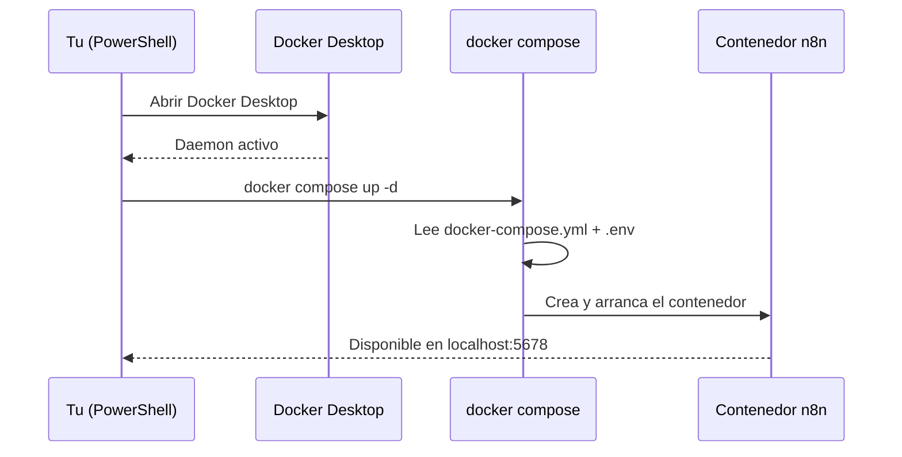

# Manual - Cap 3 - Docker desde cero

---

## Introduccion

Este capitulo cubre por que usamos Docker Compose (y no `docker run` suelto), y como esta montado el primer servicio real del proyecto: n8n.

## Diagrama: como se levanta n8n

## Ejemplo practico: por que separar `.env` de `docker-compose.yml`

`docker-compose.yml` define **la forma** del sistema (que contenedores, que puertos, que volumenes) y se versiona en Git. `.env` define **los valores concretos** (usuario, contraseña, clave de cifrado) y nunca se sube a Git. Variables clave:

| Variable | Para que sirve |
|---|---|
| `N8N_BASIC_AUTH_USER` / `_PASSWORD` | Login de acceso a la UI |
| `N8N_ENCRYPTION_KEY` | Cifra las credenciales guardadas dentro de n8n |
| `N8N_DATA_PATH` | Carpeta del host donde vive el volumen de datos |

## Buenas practicas

- Usar siempre `docker compose down` (nunca borrar el contenedor a mano) para detener servicios sin perder datos.
- No commitear nunca `.env`, solo `.env.example` como plantilla.
- Generar la clave de cifrado con un metodo aleatorio real (no escribirla a mano), y no cambiarla una vez que n8n ya tiene credenciales guardadas.

## Errores frecuentes (reales, de este mismo proyecto)

> **"failed to connect to the docker API at npipe://..."** Este error no tiene que ver con la configuracion de Docker Compose: significa que **Docker Desktop no esta corriendo**. Solucion: abrir Docker Desktop y esperar a que el icono de la bandeja del sistema deje de estar animado antes de repetir el comando.

> **Contenedor recreado pero los datos siguen ahi.** La primera vez sorprende: hacer `docker compose down` y luego `up` de nuevo **no borra** los datos de n8n, porque viven en el volumen montado en el host (`infrastructure/volumes/n8n`), no dentro del contenedor. El contenedor es descartable; el volumen no.

## Ejercicio

Para de golpe: n8n con `docker compose down`. Antes de volver a levantarlo, comprueba con el explorador de archivos que la carpeta `infrastructure/volumes/n8n` sigue teniendo contenido. Luego levanta n8n de nuevo y confirma que tus workflows siguen ahi - eso demuestra en la practica la diferencia entre contenedor y volumen.

## Resumen

n8n corre en un contenedor Docker gestionado por Docker Compose, con su configuracion sensible en `.env` (fuera de Git) y sus datos persistentes en un volumen del host. El Docker Manager del bootstrap (capitulo 2) automatiza `up`/`down`/`status`/`logs` sobre esta misma base.

## Checklist del capitulo

- [ ] Entiendo la diferencia entre `docker-compose.yml` (forma) y `.env` (valores)
- [ ] Se por que el error de "docker API" significa que Docker Desktop no esta abierto
- [ ] Entiendo que un `docker compose down` no borra los datos del volumen
- [ ] Se donde vive fisicamente el volumen de datos de n8n en mi disco

## Glosario del capitulo

- **Docker Compose**: herramienta que describe y orquesta uno o varios contenedores a partir de un archivo declarativo (`docker-compose.yml`).
- **Volumen**: carpeta del host montada dentro de un contenedor, que persiste aunque el contenedor se destruya y recree.
- **Daemon de Docker**: proceso en segundo plano que gestiona los contenedores; si no esta corriendo, ningun comando `docker` funciona.

## Ver tambien

- [[Manual Tecnico - Indice]]
- [[Manual - Cap 2 - Preparacion del entorno]]
- [[Docker Compose - n8n]]
