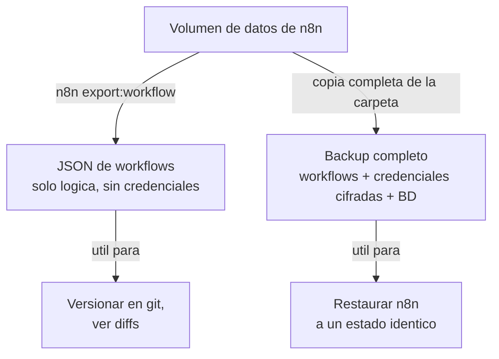

# Manual - Cap 4 - Gestion de workflows de n8n

---

## Introduccion

n8n guarda toda su informacion (workflows, credenciales, historial de ejecuciones) en una base de datos interna dentro de su volumen de datos. Este capitulo explica las dos formas de respaldar esa informacion y por que no son intercambiables.

## Diagrama: exportar vs backup completo

## Ejemplo practico: exportar, versionar y luego restaurar

1. Se crea un workflow en la UI de n8n y se guarda.
2. Desde el bootstrap, N8n Manager -> opcion 1 (exportar workflows) genera un JSON en `backups/n8n/workflows/`.
3. Ese JSON se puede commitear en git como cualquier archivo de codigo, y compararlo con versiones anteriores del mismo workflow.
4. Si mas adelante se necesita restaurar ese workflow en una instancia nueva de n8n, se usa N8n Manager -> opcion 2 (importar), indicando la ruta del JSON.
5. Tras importar, hay que reasignar manualmente la credencial en cada nodo que la use - los IDs de credencial no viajan entre instancias distintas de n8n.

## Buenas practicas

- Exportar workflows despues de cada cambio importante, no solo al final del dia.
- Hacer un backup completo (opcion 3) antes de cualquier actualizacion de la imagen de n8n (Update Manager), por si algo sale mal.
- Nombrar los workflows de forma descriptiva desde el principio - renombrarlos despues no cambia el `id` interno, pero facilita mantener la nota de seguimiento en el vault (ver [[Workflows de n8n]]).

## Errores frecuentes (reales, de este mismo proyecto)

> **"No workflows found with specified filters."** No es un fallo del script: significa que la instancia de n8n esta vacia, sin ningun workflow guardado todavia. Crear al menos un workflow de prueba antes de exportar.

> **"SQLITE_CONSTRAINT: NOT NULL constraint failed: workflow_entity.id"** al importar un JSON escrito o editado a mano. La base de datos interna de n8n exige que el objeto del workflow tenga un campo `id` propio (ademas de los `id` de cada nodo). Si se edita un export a mano, comprobar que ese campo de nivel superior existe.

> **"Unrecognized node type"** al importar un workflow que usa un nodo no incluido en la imagen de n8n instalada (ej. "Execute Command", excluido por seguridad en algunas versiones). Solucion: sustituir ese nodo por uno equivalente que si este disponible (ej. un nodo Code en JavaScript para logica que antes dependia de un comando de shell).

## Ejercicio

Exporta el workflow que ya tengas funcionando, abre el JSON resultante con un editor de texto, y localiza: el campo `id` del workflow, el `type` de cada nodo, y como se referencia una credencial (`credentials.telegramApi.name`). Entender esa estructura ayuda mucho a diagnosticar errores de importacion en el futuro.

## Resumen

n8n tiene dos rutas de respaldo con proposito distinto: exportar workflows (ligero, versionable, sin secretos) y backup completo (pesado, con secretos, el unico que realmente restaura todo). El N8n Manager del bootstrap automatiza ambas.

## Checklist del capitulo

- [ ] Se la diferencia entre exportar workflows y hacer un backup completo
- [ ] Se que tras importar un workflow hay que reasignar las credenciales a mano
- [ ] Reconozco el error de "workflow_entity.id" y su causa
- [ ] Se que hacer si un nodo importado da "Unrecognized node type"

## Glosario del capitulo

- **Credencial (n8n)**: datos de acceso a un servicio externo (ej. token de Telegram), guardados cifrados dentro de la base de datos de n8n, referenciados por nodo pero no incluidos en la exportacion de solo-workflows.
- **Nodo**: cada bloque individual de un workflow de n8n (trigger, peticion HTTP, envio de mensaje, etc.).
- **Execution**: cada vez que un workflow se ejecuta, ya sea manualmente o disparado por un trigger; el historial se puede consultar en la pestana "Executions".

## Ver tambien

- [[Manual Tecnico - Indice]]
- [[Manual - Cap 3 - Docker desde cero]]
- [[Manual - Cap 5 - IA local con Ollama]]
- [[Gestion de workflows de n8n]]
- [[Workflows de n8n]]
