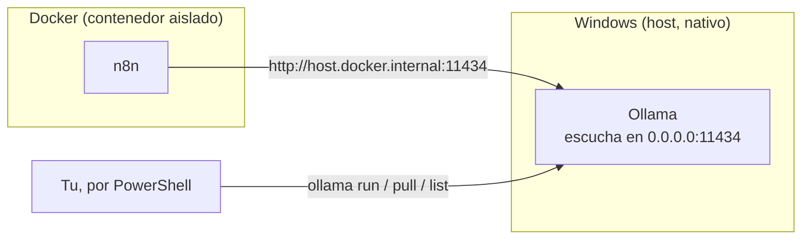

# Manual - Cap 5 - IA local con Ollama

---

## Introduccion

Ollama es la pieza que ejecuta modelos de lenguaje directamente en tu maquina, sin mandar ningun dato a servicios externos. Este capitulo cubre como elegir modelo segun el hardware disponible, y las particularidades de tenerlo corriendo junto a Docker.

## Diagrama: donde vive Ollama respecto al resto del sistema

## Ejemplo practico: elegir modelo segun la tarea

| Modelo | Tamaño aprox. | Cuando usarlo |
|---|---|---|
| `gemma2:2b` | ~1.6 GB | Respuestas rapidas, uso simultaneo con otros servicios |
| `phi3:mini` | ~2.3 GB | Buen equilibrio calidad/velocidad |
| `qwen2.5:3b` | ~2 GB | El usado en el bot de Telegram; algo mas lento bajo carga simultanea |

Para probar un modelo antes de usarlo en produccion (ej. en el workflow del bot), usar siempre primero Ollama Manager -> opcion 5 (probar con un prompt) - confirma que responde razonablemente antes de conectarlo a nada mas.

## Buenas practicas

- No cargar dos modelos a la vez de forma consciente (aunque Ollama gestiona la memoria, en 8 GB de RAM margina mucho al resto del sistema).
- Liberar el modelo de memoria (`ollama stop <modelo>`) cuando no se vaya a usar en un rato, en vez de dejarlo cargado indefinidamente.
- Revisar el Dashboard del bootstrap (opcion 0) para ver de un vistazo que modelos estan instalados antes de descargar uno nuevo por duplicado.

## Errores frecuentes (reales, de este mismo proyecto)

> **El equipo se ralentiza tras usar el bot de Telegram.** Sintoma de tener Docker + un modelo de 3B cargado en RAM + ngrok corriendo a la vez en una maquina de 8 GB. Solucion inmediata: `ollama stop <modelo>`, o "Quit Ollama" desde el icono de la bandeja del sistema si no responde. Solucion a medio plazo: usar un modelo mas ligero para el uso diario del bot.

> **n8n no puede alcanzar Ollama aunque ambos "esten corriendo".** Causa: por defecto Ollama en Windows solo escucha en `127.0.0.1` (loopback puro), que no es alcanzable desde dentro de un contenedor Docker aunque se use `host.docker.internal`. Solucion: `OLLAMA_HOST=0.0.0.0` como variable de entorno de usuario, reiniciar terminal y Ollama.

## Ejercicio

Descarga un segundo modelo ligero (por ejemplo `gemma2:2b` si ya tienes `qwen2.5:3b`) y compara, con el mismo prompt exacto, la velocidad de respuesta de ambos usando Ollama Manager -> opcion 5. Anota la diferencia en la nota [[Modelos instalados]] del vault.

## Resumen

Ollama corre nativo en Windows (no en Docker), lo que exige configurar `OLLAMA_HOST=0.0.0.0` para que contenedores como n8n puedan alcanzarlo via `host.docker.internal`. La eleccion de modelo es un compromiso directo entre calidad de respuesta y consumo de RAM en un equipo de 8 GB.

## Checklist del capitulo

- [ ] Se por que Ollama debe escuchar en `0.0.0.0` y no solo en `127.0.0.1`
- [ ] Se usar `ollama stop` para liberar RAM sin desinstalar el modelo
- [ ] Conozco al menos dos modelos ligeros alternativos a `qwen2.5:3b`
- [ ] Se donde revisar de un vistazo que modelos tengo instalados (Dashboard u Ollama Manager)

## Glosario del capitulo

- **host.docker.internal**: nombre de dominio especial que Docker Desktop expone dentro de los contenedores para alcanzar servicios que corren en el host (Windows), no dentro de Docker.
- **Loopback (127.0.0.1)**: interfaz de red que solo acepta conexiones del propio equipo; no es la misma ruta que usan los contenedores para hablar con el host.
- **Parametros de un modelo (ej. "3b")**: indica el tamaño del modelo en miles de millones de parametros; en general, mas parametros implica mejores respuestas pero mayor consumo de RAM y mas lentitud.

## Ver tambien

- [[Manual Tecnico - Indice]]
- [[Manual - Cap 4 - Gestion de workflows de n8n]]
- [[Manual - Cap 6 - El bot de Telegram]]
- [[Modelos instalados]]
