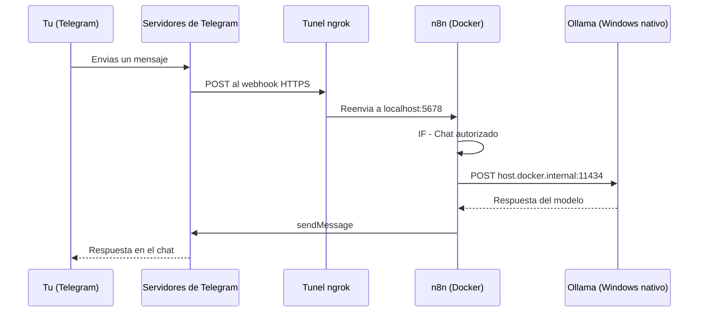

# Manual - Cap 6 - El bot de Telegram

---

## Introduccion

El bot de Telegram es donde todas las piezas anteriores (Docker, n8n, Ollama) se juntan en algo que se usa desde el movil. Este capitulo explica por que conectar "un mensaje de Telegram" con "un modelo de IA en tu propio PC" tiene mas piezas moviles de las que parece a simple vista.

## Diagrama: el camino completo de un mensaje

## Ejemplo practico: por que hacen falta 4 piezas corriendo a la vez

Para que el bot responda, necesitan estar activos simultaneamente: Docker Desktop, el contenedor de n8n, el tunel de ngrok, y Ollama. Si falta cualquiera de los cuatro, el fallo se manifiesta en un punto distinto de la cadena del diagrama de arriba - por eso diagnosticar "el bot no responde" empieza siempre por comprobar el Dashboard del bootstrap (capitulo 2) antes de mirar el workflow.

## Buenas practicas

- Revisar el Dashboard antes de asumir que el workflow esta mal configurado - la mayoria de fallos son un servicio que no esta corriendo, no un error de logica.
- Mantener el nombre de la credencial de Telegram siempre igual (`Telegram account`) para que las reasignaciones tras importar sean rapidas.
- No dejar ngrok corriendo indefinidamente en equipos con poca RAM si no se va a usar el bot - libera un proceso mas.
- Restringir el bot a un chat ID conocido (nodo "IF - Chat autorizado") antes de activarlo, nunca despues.

## Errores frecuentes (reales, de este mismo proyecto)

> **"Bad Request: bad webhook: An HTTPS URL must be provided for webhook."** Telegram exige una URL HTTPS publica para registrar el webhook; `http://localhost` nunca sirve. Solucion: tunel ngrok, y configurar `N8N_PROTOCOL`, `N8N_HOST` y `WEBHOOK_URL` acorde a la URL que da ngrok.

> **El bot no llega a Ollama aunque n8n funcione.** n8n corre en Docker, Ollama corre nativo en Windows - son redes distintas. Hace falta `host.docker.internal` en vez de `localhost`, y ademas Ollama debe escuchar en todas las interfaces (`OLLAMA_HOST=0.0.0.0`), no solo en loopback.

> **"Wrong type: '...' is a number but was expecting a string"** en el nodo IF del filtro de chat autorizado. El `chat.id` que entrega Telegram es un numero, pero el operador de comparacion por defecto en n8n espera texto. Solucion: cambiar el operador a la variante numerica, o forzar `.toString()` en la expresion.

> **El equipo se ralentiza al usar el bot.** Docker + un modelo de 3B parametros en RAM + ngrok a la vez satura 8 GB de RAM. `ollama stop <modelo>` libera la memoria sin desinstalar nada.

## Ejercicio

Apaga ngrok a proposito (Ctrl+C en su terminal) y envia un mensaje al bot. Observa que error da Telegram (o la falta de respuesta) y relacionalo con el diagrama de este capitulo: identifica exactamente en que punto de la cadena se rompio el mensaje.

## Resumen

El bot de Telegram depende de 4 servicios activos a la vez (Docker, n8n, ngrok, Ollama) conectados por un workflow que ademas filtra por chat autorizado antes de procesar nada. La mayoria de fallos son de infraestructura (algo no esta corriendo o no puede alcanzar a otra pieza), no de logica del workflow en si.

## Checklist del capitulo

- [ ] Puedo dibujar de memoria el camino completo de un mensaje, con las 4 piezas
- [ ] Se por que hace falta `host.docker.internal` en vez de `localhost`
- [ ] Se por que Ollama necesita `OLLAMA_HOST=0.0.0.0` para esto
- [ ] Se diagnosticar "el bot no responde" empezando por el Dashboard, no por el workflow

## Glosario del capitulo

- **Webhook**: URL que un servicio externo (Telegram) llama automaticamente cuando ocurre un evento (un mensaje nuevo), en vez de que tu sistema tenga que preguntar constantemente si hay algo nuevo.
- **host.docker.internal**: nombre especial que Docker Desktop resuelve a la direccion del equipo host, para que un contenedor pueda alcanzar servicios que corren fuera de Docker.
- **Tunel (ngrok)**: servicio que expone temporalmente un puerto local a traves de una URL publica HTTPS, sin necesidad de configurar el router.

## Ver tambien

- [[Manual Tecnico - Indice]]
- [[Manual - Cap 5 - IA local con Ollama]]
- [[Manual - Cap 7 - Backups y actualizaciones]]
- [[Bot de Telegram - Arquitectura]]
