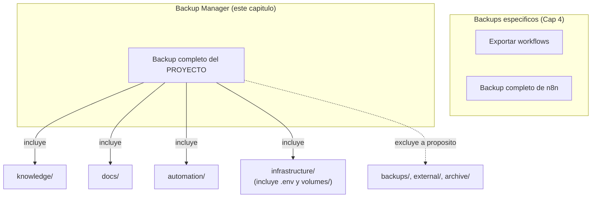

# Manual - Cap 7 - Backups y actualizaciones

---

## Introduccion

Este capitulo cierra el ciclo de vida operativo del proyecto: como se protege lo que ya funciona (Backup Manager) y como se mantiene al dia sin romperlo (Update Manager).

## Diagrama: alcance de cada tipo de backup

## Ejemplo practico: por que el backup del proyecto incluye el `.env`

Un backup "completo" que no incluya `.env` no restauraria nada util: sin la clave de cifrado de n8n, las credenciales guardadas dentro quedarian inaccesibles. Por eso `Invoke-ProjectBackup` copia `infrastructure/.env` tal cual, y por eso ese zip resultante nunca debe compartirse fuera del propio equipo - contiene secretos en texto plano dentro del comprimido.

## Buenas practicas

- Ejecutar un backup completo del proyecto antes de cualquier cambio grande (no solo antes de actualizar n8n).
- Dejar la rotacion automatica activa (`Invoke-BackupRotation`, conserva los ultimos 5 por defecto) para que `backups/full/` no crezca sin limite.
- Actualizar la imagen de n8n de vez en cuando, no dejarla fija indefinidamente - las versiones antiguas dejan de recibir parches de seguridad.
- Actualizar Ollama (la aplicacion en si) manualmente desde `ollama.com` de forma periodica - no es automatizable desde script en Windows.

## Errores frecuentes (reales, de este mismo proyecto)

> **Confundir el alcance de "backup".** El error mas facil de cometer es pensar que exportar los workflows de n8n (capitulo 4) ya es "tener un backup" del proyecto. No incluye el vault de Obsidian, ni la configuracion de infraestructura, ni el resto de `docs/`. El Backup Manager de este capitulo es el unico que cubre el proyecto entero.

> **Actualizar la imagen de n8n provoca una breve caida.** `docker compose pull` + `up -d` recrea el contenedor, lo que implica unos segundos sin servicio. No es un error, es esperado - pero conviene saberlo antes de actualizar justo cuando se esta usando el bot activamente.

## Ejercicio

Ejecuta un backup completo del proyecto (Backup Manager, opcion 1), y despues revisa cuanto pesa el `.zip` resultante. Compara ese tamano con el peso de un backup de "solo workflows" (capitulo 4) para hacerte una idea real de la diferencia de alcance entre ambos.

## Resumen

El Backup Manager protege el proyecto entero (incluyendo secretos, por eso el cuidado al compartirlo) con rotacion automatica; el Update Manager mantiene la imagen de n8n y los modelos de Ollama al dia, con la app de Ollama en si como unica pieza que se actualiza a mano.

## Checklist del capitulo

- [ ] Se la diferencia entre backup de n8n (capitulo 4) y backup del proyecto entero (este capitulo)
- [ ] Se por que el backup completo incluye el `.env` y por que hay que tener cuidado con ese archivo
- [ ] Se que actualizar n8n implica una breve caida del servicio, y no me sorprende
- [ ] Se que la app de Ollama se actualiza a mano, no por script

## Glosario del capitulo

- **Rotacion de backups**: eliminar automaticamente las copias mas antiguas cuando se supera un numero maximo, para no llenar el disco indefinidamente.
- **Recrear un contenedor**: destruir el contenedor actual y crear uno nuevo con la imagen actualizada, sin tocar los datos del volumen asociado.

## Ver tambien

- [[Manual Tecnico - Indice]]
- [[Manual - Cap 6 - El bot de Telegram]]
- [[Manual - Cap 8 - El vault de Obsidian]]
