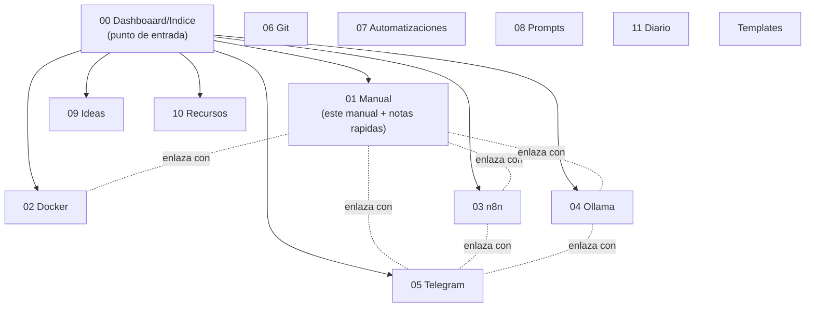

# Manual - Cap 8 - El vault de Obsidian como base de conocimiento

---

## Introduccion

Este vault no es una carpeta de apuntes sueltos: es la memoria escrita del proyecto. Este capitulo explica como esta organizado y por que las notas se enlazan entre si en vez de vivir aisladas.

## Diagrama: estructura del vault

## Ejemplo practico: el patron MOC (Mapa de Contenido)

`00 Dashboaard/Indice.md` y `Manual Tecnico - Indice.md` son notas "MOC" (Map of Content): no tienen contenido propio extenso, solo enlazan a las notas relevantes con una linea de contexto cada una. Es el patron recomendado para no perderse en un vault que crece: cuando dudes donde anotar algo nuevo, pregunta primero si deberia aparecer enlazado desde algun MOC existente.

## Buenas practicas

- Preferir muchas notas pequenas y bien enlazadas (`[[wikilinks]]`) sobre pocas notas larguisimas.
- Toda nota nueva relevante deberia aparecer enlazada desde al menos un MOC (el general o el del manual).
- Usar la seccion "Ver tambien" al final de cada nota de forma consistente - es lo que hace util la vista de grafo.
- Las plantillas de `Templates/` existen para mantener consistencia: usarlas en vez de crear notas desde cero cada vez.

## Errores frecuentes (reales, de este mismo proyecto)

> **Carpeta con errata (`00 Dashboaard`) mantenida a proposito.** Al empezar a poblar el vault, se detecto una errata en el nombre de una carpeta ya creada por el usuario. Se decidio no renombrarla para no arriesgarse a que Obsidian perdiera la referencia a los enlaces existentes - una leccion util: renombrar carpetas en un vault ya enlazado no es gratis, hazlo con cuidado si alguna vez se corrige.

## Ejercicio

Abre la vista de grafo de Obsidian (icono en la barra lateral) y localiza visualmente el "cluster" de notas relacionadas con Telegram (deberian aparecer conectadas entre si por los wikilinks). Si aparecen sueltas sin conexiones, es senal de que faltan enlaces "Ver tambien" por anadir.

## Resumen

El vault sigue el patron MOC: indices que enlazan a notas especificas, y notas especificas que se enlazan entre si por tema. Cuanto mas consistente sea el uso de wikilinks, mas util se vuelve la vista de grafo como mapa real del conocimiento del proyecto.

## Checklist del capitulo

- [ ] Se que es un MOC y donde estan los dos MOC principales del vault
- [ ] Anado wikilinks "Ver tambien" en las notas nuevas que creo
- [ ] Se por que se mantuvo la errata en el nombre de una carpeta
- [ ] He revisado la vista de grafo al menos una vez

## Glosario del capitulo

- **MOC (Map of Content)**: nota que actua como indice tematico, enlazando a otras notas relacionadas sin desarrollar el contenido ella misma.
- **Wikilink**: enlace interno de Obsidian con sintaxis `[[Nombre de la nota]]`, que ademas alimenta la vista de grafo.
- **Vista de grafo**: representacion visual del vault donde cada nota es un nodo y cada wikilink una conexion entre nodos.

## Ver tambien

- [[Manual Tecnico - Indice]]
- [[Manual - Cap 7 - Backups y actualizaciones]]
- [[Manual - Cap 9 - Sincronizacion del vault entre dispositivos]]
- [[Indice]] (00 Dashboaard)
