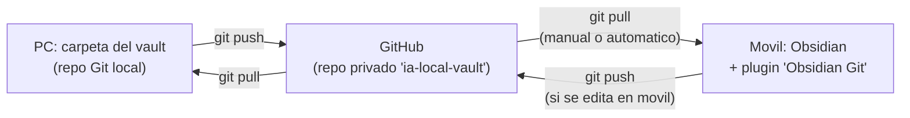

# Manual - Cap 9 - Sincronizacion del vault entre dispositivos

---

## Introduccion

El vault vive en el PC, pero se consulta y edita tambien desde el movil. Este capitulo documenta la solucion elegida (Git + GitHub, sin depender de ningun servicio de sincronizacion de pago) y los problemas reales que aparecieron al configurarla.

## Diagrama: flujo de sincronizacion

## Ejemplo practico: por que es un repositorio separado del proyecto

El vault se sincroniza como un repositorio de Git **independiente** del repositorio del proyecto IA-LOCAL completo. Dos motivos: primero, el repo del proyecto puede contener referencias a infraestructura (aunque `.env` este excluido, no conviene mezclar); segundo, el plugin de Obsidian en movil necesita que la raiz del vault (`IA Knowledge Base/`) sea directamente la raiz de un repo Git, no una subcarpeta dentro de otro repo mas grande.

## Buenas practicas

- Repositorio **privado** en GitHub - son notas personales, no codigo publico.
- `git pull` antes de empezar a editar en cualquiera de los dos dispositivos, para evitar conflictos de merge.
- Usar un Personal Access Token de GitHub para autenticar, nunca la contrasena real de la cuenta (GitHub ya no acepta contrasenas para operaciones de Git desde hace tiempo).
- En movil, no forzar el cierre de la app justo despues de cambiar configuracion del plugin - dale unos segundos para guardar antes de salir.

## Errores frecuentes (reales, de este mismo proyecto)

> **"Invalid username or token. Password authentication is not supported for Git operations."** GitHub exige un token, no la contrasena de la cuenta. Solucion: generar un Personal Access Token (Settings -> Developer settings -> Personal access tokens) con permiso `repo`, y usarlo como si fuera la contrasena.

> **"Everything is up to date" en movil, pero el PC ya habia hecho push.** Antes de sospechar del movil, comprobar directamente en github.com si los archivos realmente llegaron al repositorio remoto - si no estan ahi, el problema esta en el `push` del PC, no en el `pull` del movil.

> **En iOS, hay que volver a configurar el plugin cada vez que se abre la app.** Causa mas probable: la app se esta cerrando (deslizando desde el multitarea, o por una app "limpiadora" de memoria) antes de que iOS termine de guardar en disco los cambios de configuracion del plugin. Solucion: no forzar el cierre de la app tras tocar ajustes, revisar que "Actualizacion en segundo plano" este activada para Obsidian.

## Ejercicio

Edita una nota cualquiera desde el movil, haz push, y luego confirma en `github.com/tu-usuario/ia-local-vault` (desde el navegador, sin ni siquiera tocar el PC) que el cambio aparece reflejado en el commit mas reciente. Ese habito - verificar en GitHub directamente - es el atajo mas rapido para diagnosticar en cual de los dos extremos esta un problema de sincronizacion.

## Resumen

La sincronizacion se resuelve con un repositorio Git privado separado del proyecto principal, autenticado por token, con el flujo `push` desde el PC y `pull` (manual o automatico) desde el movil. La mayoria de problemas fueron de autenticacion (token) o de habitos de uso de la app en iOS, no de la configuracion de Git en si.

## Checklist del capitulo

- [ ] Se por que el vault usa un repo Git separado del proyecto principal
- [ ] Tengo mi Personal Access Token guardado en un sitio seguro, no solo en el plugin
- [ ] Se comprobar directamente en GitHub si un push llego, antes de asumir que el pull esta mal
- [ ] En iOS, evito forzar el cierre de la app justo despues de tocar la configuracion del plugin

## Glosario del capitulo

- **Personal Access Token (PAT)**: credencial que GitHub genera para autenticar operaciones de Git por HTTPS, en sustitucion de la contrasena de la cuenta.
- **Merge conflict**: situacion en la que Git no puede combinar automaticamente dos cambios distintos sobre la misma parte de un archivo, y requiere resolucion manual.
- **Repositorio remoto**: copia del repositorio alojada en un servidor (en este caso, GitHub), usada como punto de sincronizacion entre dispositivos.

## Ver tambien

- [[Manual Tecnico - Indice]]
- [[Manual - Cap 8 - El vault de Obsidian]]
- [[Manual - Cap 10 - Glosario general]]
- [[Convenciones de Git]]
